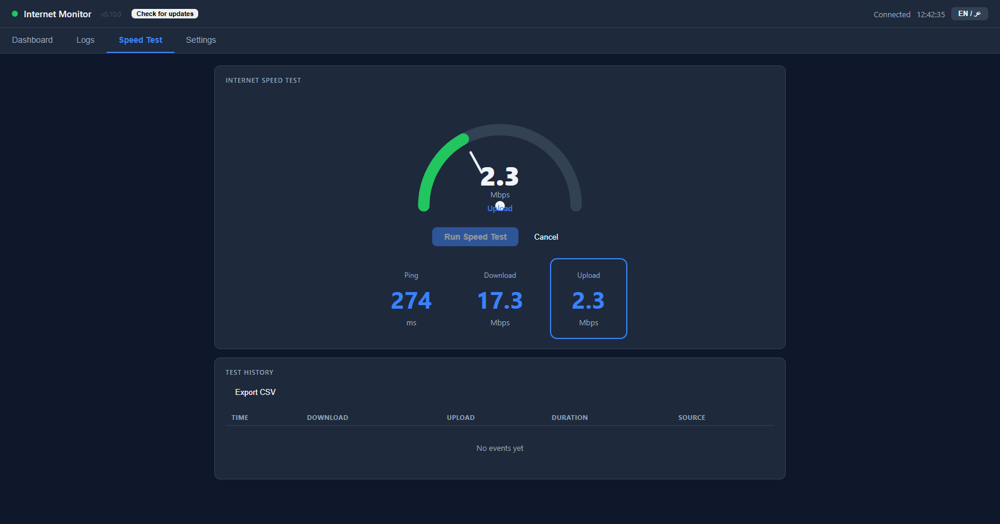
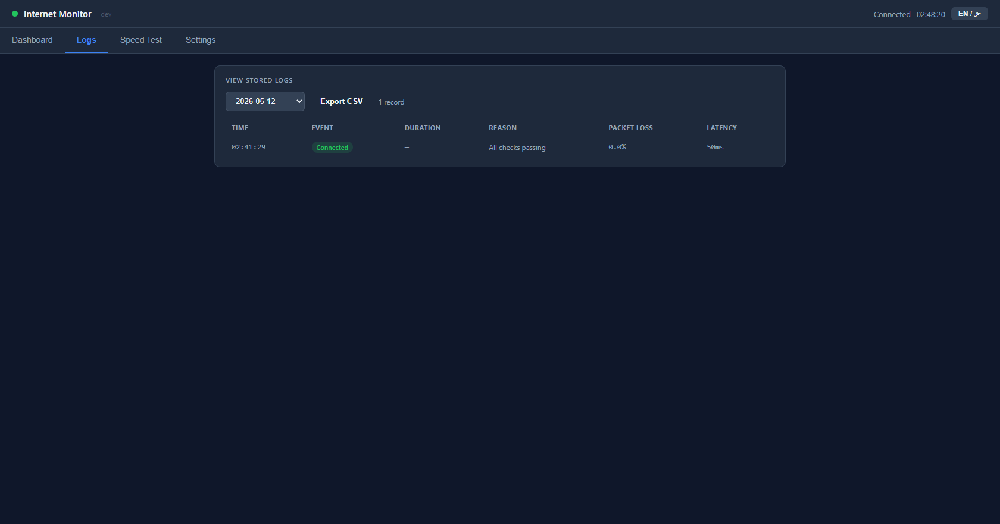

# 🌐 مراقب الإنترنت


[](https://github.com/FutureSolutionDev/internet-monitor/actions/workflows/build.yml)
[](LICENSE)
[](https://go.dev)


> [🇺🇸 Read in English](README.md)

**أداة مجانية ومفتوحة المصدر لمراقبة اتصال الإنترنت وقياس سرعته في الوقت الفعلي.**

تعمل بصمت في الخلفية، وتُسجّل كل انقطاع مع سببه ومدته، وتقيس سرعة التنزيل عند الطلب، وتعرض لوحة تحكم مرئية حية في المتصفح — مع إشعارات فورية عند كل تغيّر في حالة الاتصال.

---








## 💡 لماذا مراقب الإنترنت؟

كثيراً ما يُعاني المستخدمون من انقطاعات الإنترنت دون أي دليل ملموس — لا وقت محدد، ولا سبب، ولا مدة. **مراقب الإنترنت** يحلّ هذه المشكلة عملياً:

| من | ما يحصل عليه |
| -- | ------------ |
| 🧑 **المستخدم العادي** | إشعارات تلقائية عند كل انقطاع + قياس السرعة بنقرة واحدة |
| 🛠️ **فرق الدعم الفني** | لوحة تحكم كاملة مع سجلات قابلة للتصدير لتقديمها لمزوّد الخدمة |
| 👨‍💻 **المطوّرون** | Webhook مفصّل على Discord/Slack ببيانات هيكلية لكل فحص |

---

## ✨ المميزات

| الميزة | التفاصيل |
| ------ | --------- |
| 🔍 **فحص متعدد الطبقات** | TCP Ping + HTTP + DNS في آنٍ واحد — جميع العناوين قابلة للتخصيص كمصفوفات |
| 📊 **لوحة تحكم حية** | مخطط زمن الاستجابة + الإحصاءات + سجل الأحداث + جدول آخر الفحوصات |
| ⚡ **قياس السرعة** | قياس تنزيل تكيّفي عبر Cloudflare مع تخصيص الاتصالات المتوازية والمدة |
| 🔔 **إشعارات فورية** | Windows Toast + Discord/Slack Webhook + صوت تنبيه مخصص |
| 📋 **سجلات منظّمة** | ملفات JSONL يومية — أحداث الاتصال في `connectivity_DATE.jsonl`، قياسات السرعة في `speedtest_DATE.jsonl` |
| 📤 **تصدير CSV** | تصدير سجلات الاتصال وتاريخ قياسات السرعة من لوحة التحكم مباشرةً |
| 🔄 **تحديث تلقائي** | يفحص GitHub Releases ويُحدّث بنقرة واحدة مع إعادة تشغيل تلقائية |
| 🌐 **واجهة ثنائية اللغة** | العربية والإنجليزية مع دعم كامل RTL، قابلة للتبديل في أي وقت |
| 🖥️ **وضعان للتشغيل** | System Tray (خلفية) + نافذة مستقلة نيتيف |
| 🔒 **نسخة واحدة فقط** | يمنع تشغيل أكثر من نسخة في آنٍ واحد |
| ⚙️ **إعدادات منظّمة** | تبويبات داخلية: المراقبة / العناوين / الإشعارات / قياس السرعة |

---

## 🚀 البدء السريع

> **تحذير Windows SmartScreen؟** انقر **"مزيد من المعلومات" ← "تشغيل على أي حال"**. الملف التنفيذي غير موقَّع — الكود المصدري قابل للفحص الكامل أعلاه.

حمّل أحدث ملف تنفيذي جاهز من [**الإصدارات**](https://github.com/FutureSolutionDev/internet-monitor/releases/latest):

| الملف | نظام التشغيل | الوضع |
| ----- | ------------ | ------ |
| `internet-monitor-windows.exe` | Windows 10/11 | System Tray |
| `internet-monitor-gui-windows.exe` | Windows 10/11 | نافذة مستقلة |
| `internet-monitor-macos-arm64` | macOS M1/M2/M3 | System Tray |
| `internet-monitor-macos-intel` | macOS Intel | System Tray |
| `internet-monitor-linux` | Ubuntu/Debian | System Tray |

**Windows — شغّل مرة واحدة، ثم انقر بالزر الأيمن على أيقونة الـ Tray ← فتح لوحة التحكم:**

```bat
internet-monitor-windows.exe
```

**Windows — التثبيت للتشغيل التلقائي عند بدء الجهاز:**

```bat
scripts\install.cmd
```

**macOS / Linux:**

```bash
chmod +x internet-monitor-*
./internet-monitor-macos-arm64
```

افتح لوحة التحكم على **<http://localhost:8765>**

---

## 🧑‍💻 وضع التطوير (Live Reload)

### الخيار الأول — `go run` (الأبسط)

```bash
git clone https://github.com/FutureSolutionDev/internet-monitor.git
cd internet-monitor
go mod tidy
go run .
```

### الخيار الثاني — [Air](https://github.com/air-verse/air) (إعادة بناء تلقائية عند تغيير الملفات)

```bash
# تثبيت air
go install github.com/air-verse/air@latest

# التشغيل مع Live Reload
air
```

يراقب Air ملفات `.go` و`.html` و`.js` و`.css` ويُعيد البناء تلقائياً.

افتح لوحة التحكم على **<http://localhost:8765>** — عدّل أي ملف وسيُعاد تشغيل البرنامج.

> نسخة النافذة النيتيف (GUI) تحتاج GCC — انظر [البناء من المصدر](#️-البناء-من-المصدر) أدناه.

---

## 🛠️ البناء من المصدر

### المتطلبات

| الأداة | الإصدار | ملاحظة |
| ------ | ------- | ------- |
| [Go](https://go.dev/dl/) | 1.21+ | مطلوب |
| GCC (يُنصح بـ TDM-GCC) | أي إصدار | اختياري — لنسخة النافذة النيتيف فقط |

### نسخة الـ Tray — لا تحتاج CGO

```bash
git clone https://github.com/FutureSolutionDev/internet-monitor.git
cd internet-monitor
go mod tidy
CGO_ENABLED=0 go build -ldflags="-H=windowsgui -s -w" -o internet-monitor.exe .
```

### نسخة النافذة النيتيف — تحتاج GCC

**Windows** — يُثبّت TDM-GCC تلقائياً إذا لم يكن موجوداً:

```bat
scripts\build-gui.cmd
```

**macOS / Linux** — GCC مثبّت مسبقاً:

```bash
go build -ldflags="-s -w" -o internet-monitor-gui ./cmd/gui/
```

### السكريبتات المتاحة

```text
scripts\build.cmd        بناء الـ Tray exe
scripts\build-gui.cmd    بناء النافذة النيتيف (يُثبّت GCC إذا لزم)
scripts\build-debug.cmd  بناء مع console مرئي (للتصحيح)
scripts\run.cmd          بناء وتشغيل (Tray)
scripts\run-gui.cmd      بناء وتشغيل (نافذة نيتيف — تحتاج GCC)
scripts\stop.cmd         إيقاف النسخة الجارية
scripts\install.cmd      تثبيت في Windows Startup
scripts\uninstall.cmd    إزالة من Startup
scripts\logs.cmd         فتح مجلد السجلات
```

### CI/CD — GitHub Actions

كل push على `master` يُطلق بناءً تلقائياً لجميع المنصات:

```text
Windows Tray  →  cross-compiled على Linux (CGO معطّل)
Windows GUI   →  windows-latest runner
macOS         →  macos-latest (arm64 نيتيف + intel cross-compile)
Linux         →  ubuntu-22.04 (WebKitGTK 4.0)
```

---

## ⚙️ الإعدادات

يُنشأ `config.json` تلقائياً عند أول تشغيل بقيم افتراضية مناسبة.
عدّله مباشرةً أو استخدم **تاب الإعدادات** في لوحة التحكم.

```json
{
  "check_interval_sec": 5,
  "ping_targets":  ["8.8.8.8:53", "1.1.1.1:53"],
  "http_targets":  ["https://connectivitycheck.gstatic.com/generate_204"],
  "dns_targets":   ["www.google.com", "www.cloudflare.com"],
  "fail_threshold": 3,
  "packet_loss_threshold": 20.0,
  "latency_threshold_ms": 500,
  "log_dir": "logs",
  "webhook_url": "",
  "dashboard_port": 8765,
  "speed_test": {
    "download_targets": ["https://speed.cloudflare.com/__down"],
    "parallel_connections": 4,
    "timeout_seconds": 10,
    "alert_threshold_mbps": 0
  }
}
```

| الحقل | الوصف |
| ----- | ----- |
| `ping_targets` | عناوين TCP — يُجرَّب الكل بالتوازي، يكفي نجاح واحد |
| `http_targets` | روابط HTTP — يُجرَّب الأول ثم الثاني عند الفشل |
| `dns_targets` | نطاقات DNS — يُجرَّب الأول ثم الثاني عند الفشل |
| `fail_threshold` | عدد الفشل المتتالي قبل إعلان الانقطاع |
| `webhook_url` | رابط Discord أو Slack (اتركه فارغاً لتعطيله) |
| `speed_test.parallel_connections` | اتصالات متوازية في اختبار التنزيل (1–8، افتراضي 4) |
| `speed_test.timeout_seconds` | مدة اختبار التنزيل بالثواني (افتراضي 10) |
| `speed_test.alert_threshold_mbps` | أرسل Webhook إذا انخفضت السرعة عن هذا الحد (0 = معطّل) |

---

## 📡 الـ Webhooks — Discord وSlack

يُرسل مراقب الإنترنت إشعارات Webhook لثلاثة أنواع من الأحداث:

| المُحفّز | محتوى الـ Payload |
| ------- | ----------------- |
| حدث اتصال (متصل / ضعيف / منقطع) | حالة كل طبقة + فقدان الحزم + المدة |
| اختبار العناوين (من الإعدادات) | زمن الاستجابة ونتيجة كل عنوان |
| نتيجة قياس السرعة | سرعة التنزيل + المدة + زمن الاستجابة |

### Discord — مثال على حدث انقطاع

```json
{
  "username": "Internet Monitor",
  "embeds": [{
    "title": "❌ Internet Disconnected",
    "color": 16007988,
    "fields": [
      {"name": "🔌 TCP Ping",    "value": "❌ Failed", "inline": true},
      {"name": "🌐 HTTP",        "value": "❌ Failed", "inline": true},
      {"name": "🔍 DNS",         "value": "✅ OK",     "inline": true},
      {"name": "📉 Packet Loss", "value": "85.0%",    "inline": true},
      {"name": "⏱️ Duration",    "value": "2m 15s",   "inline": true}
    ],
    "timestamp": "2026-05-11T14:30:00Z"
  }]
}
```

### Discord — مثال على نتيجة قياس السرعة

```json
{
  "username": "Internet Monitor",
  "embeds": [{
    "title": "🚀 Speed Test Completed",
    "color": 2278718,
    "fields": [
      {"name": "📥 Download", "value": "94.3 Mbps", "inline": true},
      {"name": "⏱️ Duration", "value": "10.0s",     "inline": true},
      {"name": "📡 Latency",  "value": "12ms",       "inline": true}
    ]
  }]
}
```

---

## ⚡ قياس السرعة

يستخدم الاختبار المدمج نهج **التنزيل التكيّفي عبر HTTP**:

- يبدأ بـ payloads صغيرة ويزيد حجمها تدريجياً خلال المدة المُحدَّدة
- يفتح عدة اتصالات متوازية (افتراضي: 4) لاستيعاب الروابط السريعة
- يستخدم **endpoint Cloudflare** (`speed.cloudflare.com`) افتراضياً — لا يحتاج حساباً
- تُحفظ النتائج في `logs/speedtest_DATE.jsonl` (منفصلة عن سجلات الاتصال)
- التاريخ قابل للعرض والتصدير كـ CSV مباشرةً من لوحة التحكم

> **الخصوصية:** لا تحتوي payloads الاختبار على أي معرّفات للجهاز. تذهب حركة البيانات فقط إلى العنوان الذي تُحدّده في الإعدادات.

---

## 📂 هيكل المشروع

```text
internet-monitor/
├── main.go                   نقطة الدخول — نسخة الـ Tray
├── singleton_*.go            حارس النسخة الواحدة (لكل نظام تشغيل)
├── cmd/gui/                  نسخة النافذة النيتيف
│   ├── main.go
│   ├── gui_notifier.go       تنفيذ Notifier خاص بالـ GUI
│   ├── tray_windows.go       Systray في الخلفية لنسخة GUI
│   └── notify_*.go           إشعارات OS (Windows / Unix)
├── core/                     محرك المراقبة المشترك
│   ├── engine.go             Engine + Notifier interface + MultiNotifier
│   └── doc.go
├── types/                    الأنواع المشتركة (CheckResult, Status, Event)
├── speedtest/                محرك قياس سرعة التنزيل التكيّفي
├── config/                   Config struct والتحميل والترحيل
├── monitor/                  محرك الفحص — TCP / HTTP / DNS
├── dashboard/                خادم HTTP، SSE، REST APIs، assets مدمجة
│   ├── server.go
│   ├── notifier.go           DashNotifier (تنفيذ core.Notifier)
│   └── assets/               HTML / CSS / JS مدمجة (Chart.js محلي)
├── logger/                   تسجيل JSONL + تنسيق Discord/Slack webhook
├── tray/                     أيقونة الـ Tray، القائمة، إشعارات OS
│   └── notifier.go           TrayNotifier (تنفيذ core.Notifier)
├── updater/                  GitHub Releases API + minio/selfupdate
├── startup/                  تسجيل بدء التشغيل مع OS
├── .github/workflows/        build.yml — CI/CD لجميع المنصات
└── scripts/                  سكريبتات البناء والتثبيت والتشغيل (Windows)
```

---

## 📋 تنسيق السجلات

```text
logs/
  connectivity_2026-05-11.jsonl   أحداث الاتصال (JSON واحد لكل سطر)
  speedtest_2026-05-11.jsonl      نتائج قياس السرعة (JSON واحد لكل سطر)
  app.log                          أخطاء التطبيق وحالة الـ webhook
```

**حدث اتصال:**

```json
{
  "timestamp": "2026-05-11T14:30:00Z",
  "event": "disconnected",
  "duration_seconds": 45.2,
  "reason": {
    "tcp_ping_failed": true,
    "http_failed": true,
    "dns_failed": false,
    "packet_loss_pct": 80.0,
    "avg_latency_ms": 0
  }
}
```

**نتيجة قياس السرعة:**

```json
{
  "timestamp": "2026-05-11T14:35:00Z",
  "event": "speed_test",
  "download_mbps": 94.3,
  "upload_mbps": null,
  "latency_ms": 12,
  "duration_seconds": 9.8,
  "endpoints": ["https://speed.cloudflare.com/__down"],
  "parallel_connections": 4,
  "triggered_by": "user"
}
```

---

## 🤝 المساهمة

كل المساهمات مرحّب بها — بلاغات أخطاء، ميزات جديدة، ترجمات، توثيق.

### 1. Fork والاستنساخ

```bash
git clone https://github.com/YOUR_USERNAME/internet-monitor.git
cd internet-monitor
go mod tidy
```

### 2. إنشاء فرع

```bash
git checkout -b feature/اسم-الميزة
```

### 3. اتفاقية الـ Commits

نستخدم [Conventional Commits](https://www.conventionalcommits.org/) — نوع الـ commit يُحدّد رقم الإصدار تلقائياً:

| البادئة | رقم الإصدار | مثال |
| ------- | ----------- | ----- |
| `feat:` | minor (v1.1.0) | `feat: إضافة وضع الليل` |
| `fix:` | patch (v1.0.1) | `fix: إصلاح timeout على macOS` |
| `BREAKING CHANGE` | major (v2.0.0) | في جسم الـ commit |
| `docs:`, `refactor:` | patch | بدون تغيير وظيفي |

### 4. فتح Pull Request

- اشرح الدافع بوضوح
- أرفق صورة لأي تغيير مرئي
- تأكد من نجاح `go build ./...`

### مجالات تحتاج مساعدة

- دعم بناء Windows ARM64
- تكامل Telegram webhook
- تحسين استجابة لوحة التحكم للموبايل
- تكامل macOS native menu bar
- مخططات زمن الاستجابة لكل عنوان على حدة
- دعم لغات إضافية

---

## 🗺️ خارطة الطريق

| الميزة | الحالة |
| ------ | ------ |
| ⬆️ قياس سرعة الرفع | 🔜 v2 |
| 📬 دعم Telegram webhook | 🔜 مخطط |
| ⏰ جدولة قياسات السرعة تلقائياً | 🔜 مخطط |
| 📱 لوحة تحكم متجاوبة للموبايل | 🔜 مخطط |
| 🪟 بناء Windows ARM64 | 🔜 مخطط |
| 📈 تحليلات لكل مزوّد خدمة وتقارير أسبوعية | 💡 مقترح |
| 📄 تصدير تقرير PDF (للشكاوى لمزوّد الخدمة) | 💡 مقترح |
| 🔌 Plugin API لأنواع فحص مخصصة | 💡 مقترح |

---

## 📄 الرخصة

MIT — مجاني للاستخدام الشخصي والتجاري.

صُنع بـ ❤️ بواسطة [FutureSolutionDev](https://github.com/FutureSolutionDev)
