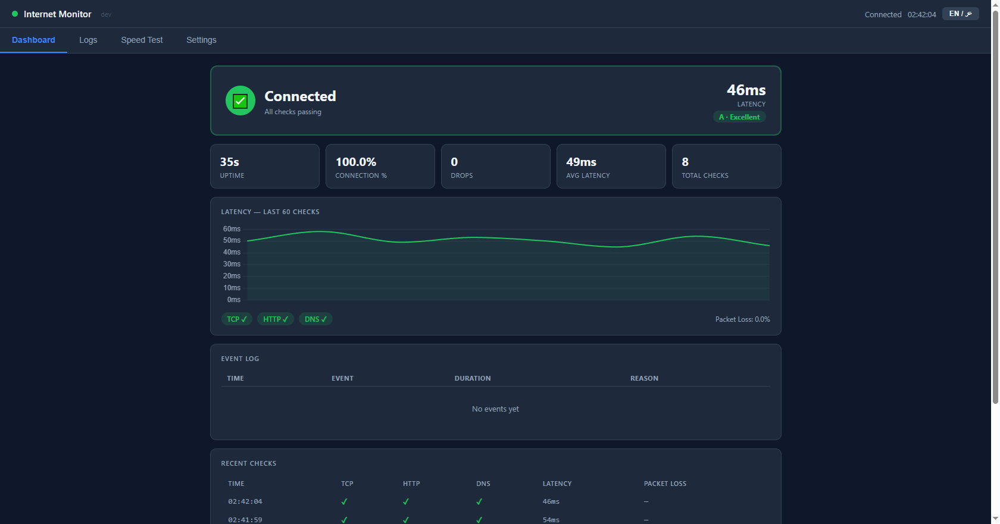
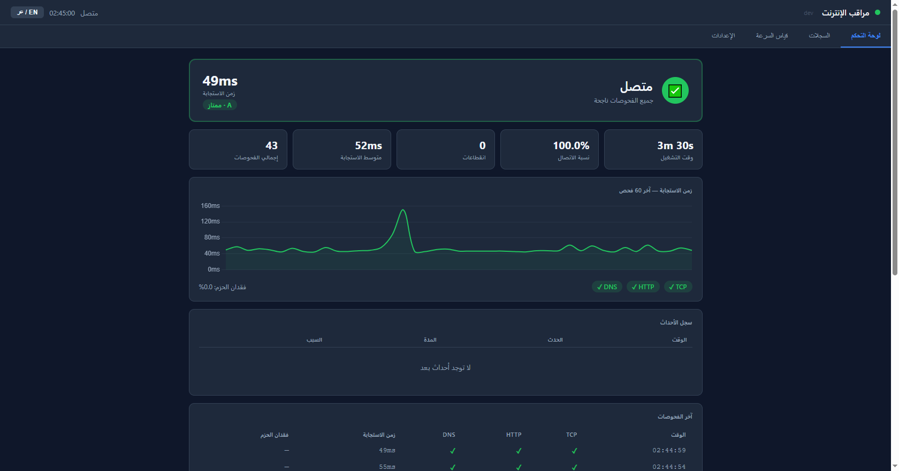
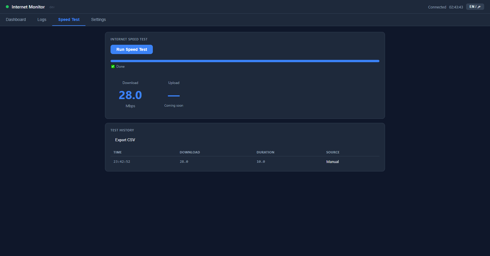
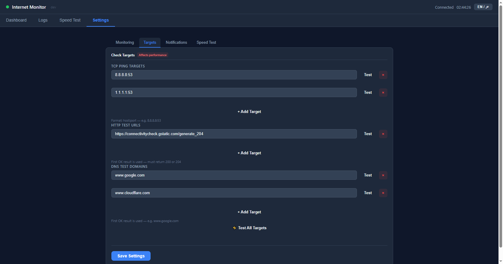

# 🌐 Internet Monitor

[](https://github.com/FutureSolutionDev/internet-monitor/actions/workflows/build.yml)
[](LICENSE)
[](https://go.dev)


> [🇸🇦 اقرأ بالعربية](README.ar.md)

**A free, open-source tool for real-time internet connectivity monitoring and speed testing.**

Runs silently in the background, logs every disconnection with its cause and duration, measures your download speed on demand, and displays a live visual dashboard in your browser — with instant notifications on every status change.

---









## 💡 Why Internet Monitor?

Users often experience internet drops without any concrete evidence — no timestamps, no causes, no durations. **Internet Monitor** solves this practically:

| Who | What they get |
| --- | ------------- |
| 🧑 **End users** | Automatic notifications on every drop + one-click speed test |
| 🛠️ **Support teams** | Full dashboard with exportable JSONL/CSV logs to present to ISPs |
| 👨‍💻 **Developers** | Detailed Discord/Slack webhook with structured per-check data |

---

## ✨ Features

| Feature | Details |
| ------- | ------- |
| 🔍 **Multi-layer checking** | TCP Ping + HTTP + DNS simultaneously — all targets configurable as arrays |
| 📊 **Live dashboard** | Real-time latency chart + stats + event log + recent checks table |
| ⚡ **Speed Test** | Adaptive download measurement (Cloudflare endpoint) with configurable parallel connections and timeout |
| 🔔 **Instant notifications** | Windows Toast + Discord/Slack Webhook + custom alert sound |
| 📋 **Structured logs** | Daily JSONL files — connectivity events in `connectivity_DATE.jsonl`, speed tests in `speedtest_DATE.jsonl` |
| 📤 **CSV export** | Export connectivity logs and speed test history directly from the dashboard |
| 🔄 **Auto-update** | Checks GitHub Releases, one-click update with automatic restart |
| 🌐 **Bilingual UI** | Arabic & English with full RTL support, toggle anytime |
| 🖥️ **Two modes** | System Tray (background) + Standalone native window |
| 🔒 **Single instance** | Prevents running more than one copy at the same time |
| ⚙️ **Settings tabs** | Organized settings: Monitoring / Targets / Notifications / Speed Test |

---

## 🚀 Quick Start

> **Windows SmartScreen warning?** Click **"More info" → "Run anyway"**. The binary is unsigned — the source code is fully auditable above.

Download the latest pre-built binary from [**Releases**](https://github.com/FutureSolutionDev/internet-monitor/releases/latest):

| File | OS | Mode |
| ---- | -- | ---- |
| `internet-monitor-windows.exe` | Windows 10/11 | System Tray |
| `internet-monitor-gui-windows.exe` | Windows 10/11 | Standalone window |
| `internet-monitor-macos-arm64` | macOS M1/M2/M3 | System Tray |
| `internet-monitor-macos-intel` | macOS Intel | System Tray |
| `internet-monitor-linux` | Ubuntu/Debian | System Tray |

**Windows — run once, then right-click the tray icon → Open Dashboard:**

```bat
internet-monitor-windows.exe
```

**Windows — install to run automatically at startup:**

```bat
scripts\install.cmd
```

**macOS / Linux:**

```bash
chmod +x internet-monitor-*
./internet-monitor-macos-arm64
```

Open the dashboard at **<http://localhost:8765>**

---

## 🧑‍💻 Dev Mode (Live Reload)

### Option A — `go run` (simplest)

```bash
git clone https://github.com/FutureSolutionDev/internet-monitor.git
cd internet-monitor
go mod tidy
go run .
```

### Option B — [Air](https://github.com/air-verse/air) (auto-rebuild on file change)

```bash
# Install air
go install github.com/air-verse/air@latest

# Run with live reload
air
```

Air watches `.go`, `.html`, `.js`, and `.css` files and rebuilds automatically.

Open the dashboard at **<http://localhost:8765>** — edit any source file and the binary reloads.

> The native window (GUI) version requires GCC — see [Build from Source](#️-build-from-source) below.

---

## 🛠️ Build from Source

### Requirements

| Tool | Version | Note |
| ---- | ------- | ---- |
| [Go](https://go.dev/dl/) | 1.21+ | Required |
| GCC (TDM-GCC recommended) | any | Optional — native window version only |

### Tray version — no CGO needed

```bash
git clone https://github.com/FutureSolutionDev/internet-monitor.git
cd internet-monitor
go mod tidy
CGO_ENABLED=0 go build -ldflags="-H=windowsgui -s -w" -o internet-monitor.exe .
```

### Native window version — requires GCC

**Windows** — auto-installs TDM-GCC if missing:

```bat
scripts\build-gui.cmd
```

**macOS / Linux** — GCC is pre-installed:

```bash
go build -ldflags="-s -w" -o internet-monitor-gui ./cmd/gui/
```

### Available scripts

```text
scripts\build.cmd        Build tray exe
scripts\build-gui.cmd    Build native window (auto-installs GCC if missing)
scripts\build-debug.cmd  Build with visible console (debugging)
scripts\run.cmd          Build and run (tray)
scripts\run-gui.cmd      Build and run (native window — requires GCC)
scripts\stop.cmd         Stop running instance
scripts\install.cmd      Install to Windows Startup
scripts\uninstall.cmd    Remove from Startup
scripts\logs.cmd         Open logs folder
```

### CI/CD — GitHub Actions

Every push to `master` triggers automatic builds for all platforms:

```text
Windows Tray  →  cross-compiled on Linux (CGO disabled)
Windows GUI   →  windows-latest runner
macOS         →  macos-latest (arm64 native + intel cross-compile)
Linux         →  ubuntu-22.04 (WebKitGTK 4.0)
```

---

## ⚙️ Configuration

`config.json` is created automatically on first run with sensible defaults.
Edit it directly or use the **Settings tab** in the dashboard.

```json
{
  "check_interval_sec": 5,
  "ping_targets":  ["8.8.8.8:53", "1.1.1.1:53"],
  "http_targets":  ["https://connectivitycheck.gstatic.com/generate_204"],
  "dns_targets":   ["www.google.com", "www.cloudflare.com"],
  "fail_threshold": 3,
  "packet_loss_threshold": 20.0,
  "latency_threshold_ms": 500,
  "log_dir": "logs",
  "webhook_url": "",
  "dashboard_port": 8765,
  "speed_test": {
    "download_targets": ["https://speed.cloudflare.com/__down"],
    "parallel_connections": 4,
    "timeout_seconds": 10,
    "alert_threshold_mbps": 0
  }
}
```

| Field | Description |
| ----- | ----------- |
| `ping_targets` | TCP addresses — tries all in parallel, OK if any succeeds |
| `http_targets` | HTTP URLs — tries in order until one returns 200/204 |
| `dns_targets` | DNS domains — tries in order until one resolves |
| `fail_threshold` | Consecutive failures before declaring disconnected |
| `webhook_url` | Discord or Slack webhook URL (leave empty to disable) |
| `speed_test.parallel_connections` | Parallel HTTP connections for download test (1–8, default 4) |
| `speed_test.timeout_seconds` | Download test duration in seconds (default 10) |
| `speed_test.alert_threshold_mbps` | Send webhook if speed drops below this value (0 = disabled) |

---

## 📡 Webhooks — Discord & Slack

Internet Monitor sends webhook notifications for three event types:

| Trigger | Payload |
| ------- | ------- |
| Connectivity event (connected / degraded / disconnected) | Per-layer status + packet loss + duration |
| Test Targets (from Settings) | Per-target latency and pass/fail |
| Speed Test result | Download speed + duration + latency |

### Discord example — disconnection event

```json
{
  "username": "Internet Monitor",
  "embeds": [{
    "title": "❌ Internet Disconnected",
    "color": 16007988,
    "fields": [
      {"name": "🔌 TCP Ping",    "value": "❌ Failed", "inline": true},
      {"name": "🌐 HTTP",        "value": "❌ Failed", "inline": true},
      {"name": "🔍 DNS",         "value": "✅ OK",     "inline": true},
      {"name": "📉 Packet Loss", "value": "85.0%",    "inline": true},
      {"name": "⏱️ Duration",    "value": "2m 15s",   "inline": true}
    ],
    "timestamp": "2026-05-11T14:30:00Z"
  }]
}
```

### Discord example — speed test result

```json
{
  "username": "Internet Monitor",
  "embeds": [{
    "title": "🚀 Speed Test Completed",
    "color": 2278718,
    "fields": [
      {"name": "📥 Download", "value": "94.3 Mbps", "inline": true},
      {"name": "⏱️ Duration", "value": "10.0s",     "inline": true},
      {"name": "📡 Latency",  "value": "12ms",       "inline": true}
    ]
  }]
}
```

---

## ⚡ Speed Test

The built-in speed test uses an **adaptive HTTP download** approach:

- Starts with small payloads and increases chunk size over the configured duration
- Opens multiple parallel connections (default: 4) to saturate modern high-speed links
- Uses **Cloudflare's speed endpoint** (`speed.cloudflare.com`) by default — no account required
- Results are stored in `logs/speedtest_DATE.jsonl` (separate from connectivity logs)
- History is viewable and exportable as CSV directly from the dashboard

> **Privacy:** speed test payloads contain no device identifiers. Traffic goes only to the endpoint you configure in Settings → Speed Test.

---

## 📂 Project Structure

```text
internet-monitor/
├── main.go                   Entry point — Tray version
├── singleton_*.go            Single-instance guard (per OS)
├── cmd/gui/                  Native window version
│   ├── main.go
│   ├── gui_notifier.go       GUI-specific Notifier implementation
│   ├── tray_windows.go       Background systray in GUI mode
│   └── notify_*.go           OS notifications (Windows / Unix)
├── core/                     Shared monitoring engine
│   ├── engine.go             Engine struct + Notifier interface + MultiNotifier
│   └── doc.go
├── types/                    Shared data types (CheckResult, Status, Event)
├── speedtest/                Adaptive download speed test engine
├── config/                   Config struct, loading, migration
├── monitor/                  Check engine — TCP / HTTP / DNS
├── dashboard/                HTTP server, SSE stream, REST APIs, embedded assets
│   ├── server.go
│   ├── notifier.go           DashNotifier (core.Notifier implementation)
│   └── assets/               Embedded HTML / CSS / JS (Chart.js local)
├── logger/                   JSONL logging + Discord/Slack webhook formatting
├── tray/                     System tray icon, menu, OS notifications
│   └── notifier.go           TrayNotifier (core.Notifier implementation)
├── updater/                  GitHub Releases API + minio/selfupdate
├── startup/                  OS startup registration
├── .github/workflows/        build.yml — CI/CD for all platforms
└── scripts/                  Windows build / install / run helpers
```

---

## 📋 Log Format

```text
logs/
  connectivity_2026-05-11.jsonl   Connectivity events (one JSON per line)
  speedtest_2026-05-11.jsonl      Speed test results (one JSON per line)
  app.log                          App errors and webhook status
```

**Connectivity event:**

```json
{
  "timestamp": "2026-05-11T14:30:00Z",
  "event": "disconnected",
  "duration_seconds": 45.2,
  "reason": {
    "tcp_ping_failed": true,
    "http_failed": true,
    "dns_failed": false,
    "packet_loss_pct": 80.0,
    "avg_latency_ms": 0
  }
}
```

**Speed test result:**

```json
{
  "timestamp": "2026-05-11T14:35:00Z",
  "event": "speed_test",
  "download_mbps": 94.3,
  "upload_mbps": null,
  "latency_ms": 12,
  "duration_seconds": 9.8,
  "endpoints": ["https://speed.cloudflare.com/__down"],
  "parallel_connections": 4,
  "triggered_by": "user"
}
```

---

## 🤝 Contributing

All contributions are welcome — bugs, features, translations, documentation.

### 1. Fork and clone

```bash
git clone https://github.com/YOUR_USERNAME/internet-monitor.git
cd internet-monitor
go mod tidy
```

### 2. Create a branch

```bash
git checkout -b feature/your-feature-name
```

### 3. Commit convention

We use [Conventional Commits](https://www.conventionalcommits.org/) — commit type drives auto-versioning:

| Prefix | Version bump | Example |
| ------ | ------------ | ------- |
| `feat:` | minor (v1.1.0) | `feat: add dark mode toggle` |
| `fix:` | patch (v1.0.1) | `fix: resolve DNS timeout on macOS` |
| `BREAKING CHANGE` | major (v2.0.0) | in commit body |
| `docs:`, `refactor:` | patch | no functional change |

### 4. Open a Pull Request

- Describe the motivation clearly
- Attach a screenshot for any visual change
- Confirm `go build ./...` passes

### Areas looking for help

- Windows ARM64 build support
- Telegram webhook integration
- Mobile-responsive dashboard improvements
- macOS native menu bar integration
- Per-target latency history charts
- Additional language support

---

## 🗺️ Roadmap

| Feature | Status |
| ------- | ------ |
| ⬆️ Upload speed measurement | 🔜 v2 |
| 📬 Telegram webhook support | 🔜 Planned |
| ⏰ Scheduled speed tests | 🔜 Planned |
| 📱 Mobile-responsive dashboard | 🔜 Planned |
| 🪟 Windows ARM64 build | 🔜 Planned |
| 📈 Per-ISP analytics & weekly reports | 💡 Proposed |
| 📄 PDF report export (for ISP complaints) | 💡 Proposed |
| 🔌 Plugin API for custom check types | 💡 Proposed |

---

## 📄 License

MIT — Free for personal and commercial use.

Built with ❤️ by [FutureSolutionDev](https://github.com/FutureSolutionDev)
